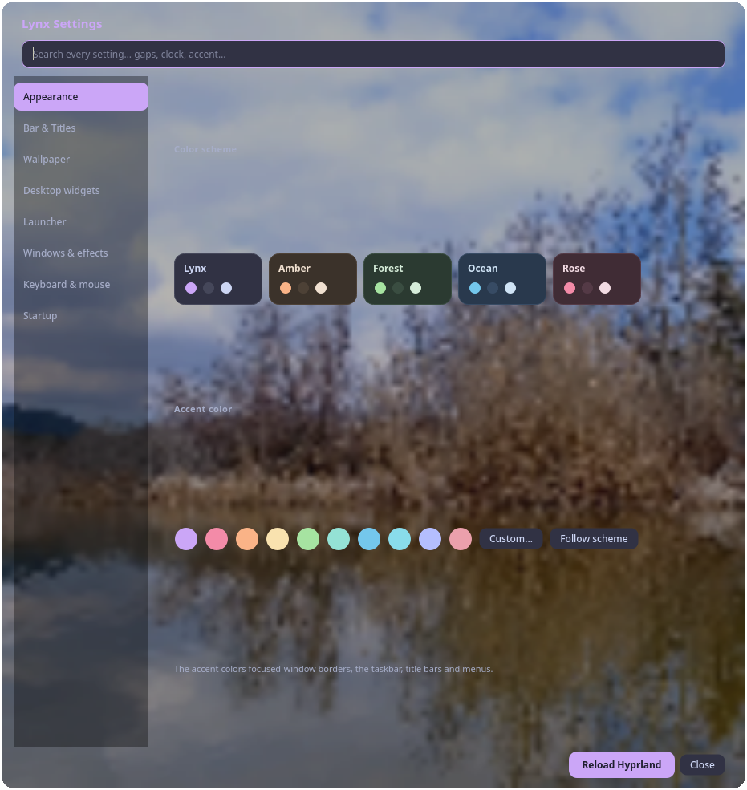
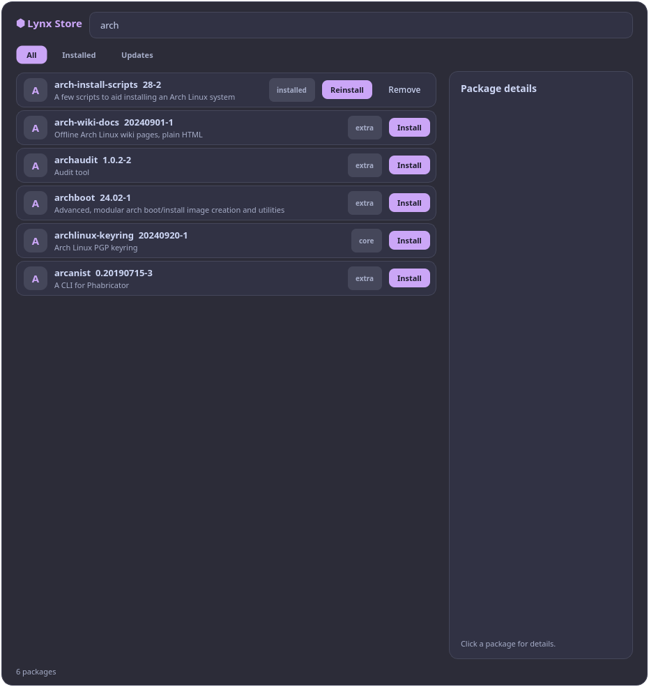
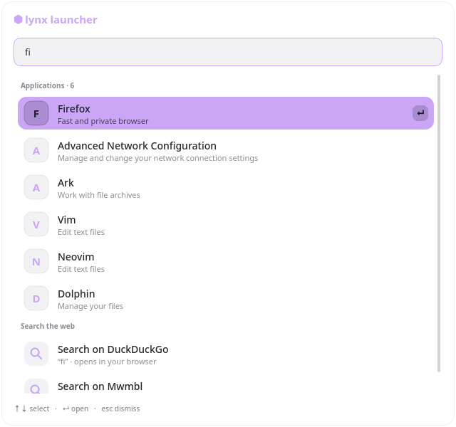

<div align="center">


# lynxde

**A memory-safe, pure-Python desktop environment with its own compositor.**

MIT License

A complete desktop environment running on **LWP** (Lynx Window Protocol),
its own display protocol designed for memory safety (sealed shared buffers,
bounded allocations, fail-closed decoding) and lower overhead than generic
display protocols — all pure Python on Qt 6 (PySide6).

</div>

## Highlights

| | |
|---|---|
| **LWP Compositor** | Custom display protocol with zero-copy pixel handoff, batched damage, and sealed memfd buffers |
| **Pure Python** | Every component is Python + PySide6 (Qt 6), no C extensions, no external Python dependencies |
| **Memory Safety by Construction** | Bounded allocations, generation-stamped buffer lifetimes, 16-byte fixed headers |
| **Live Settings** | All changes apply instantly to the running desktop — no restart needed |
| **Legacy Compatibility** | Hyprland sessions kept forever via LWP's Wayland bridge layer |

| Settings | Lynx Store | Launcher |
|---|---|---|
|  |  |  |

## Install

### pacman (recommended)

```sh
# Add the lynxde repository
sudo pacman -S wget
wget -qO /tmp/lynx-de-keyring.pkg.tar.zst https://eotter-beep.github.io/lynxDE/x86_64/lynx-de-0.1.0-1-x86_64.pkg.tar.zst
sudo pacman -U /tmp/lynx-de-keyring.pkg.tar.zst

# Or add manually to /etc/pacman.conf:
# [lynx-de]
# Server = https://eotter-beep.github.io/lynxDE/x86_64

sudo pacman -S lynx-de
```

### Manual install

```sh
git clone https://github.com/eotter-beep/lynxDE.git
cd lynxDE
./install.sh
```

The installer handles everything and starts the LWP desktop right away
if you are already logged in.

### What the installer does

## Components

| Command | What it does |
|---|---|
| `lynx-compositor` | LWP compositor: tiling, input routing, damage tracking, KMS/nested/headless/Wayland-bridge backends, JSON control plane |
| `lynx-taskbar` | Layer-shell panel with workspace switcher, window list, tray area |
| `lynx-titles` | Server-drawn title bars for legacy sessions (native under LWP) |
| `lynx-wallpaper` | Video and image wallpaper daemon |
| `lynx-launcher` | Command palette: apps, DuckDuckGo/Mwmbl web search, pacman packages (`SUPER + /`) |
| `lynx-settings` | Full control panel: color schemes, tiling, wallpaper, widgets, effects, keybinds (`SUPER + O`) |
| `lynx-store` | Package manager GUI: browse, install, remove, update pacman packages |
| `lynx-welcome` | First-run welcome screen with keybinds and startup chime |
| `lynx-autostart` | Runs your user-defined autostart commands at login |
| `lynx-update` | Auto-updater: checks GitHub, downloads, applies live, no re-login needed |

## Desktop Features

### Tiling & Layouts
- Dwindle and master tiling layouts
- Configurable inner/outer gaps
- Border width and corner rounding
- Active/inactive window opacity

### Visual Effects
- Native frosted-glass blur (`lynx_blur.py`)
- Window shadows
- Configurable animation speed
- Five built-in color schemes plus custom accent colors
- Focused-window border recoloring

### Taskbar & Title Bars
- Layer-shell native docking
- 12/24-hour clock with optional seconds and date
- Brand label visibility toggle
- Title bars on/off (server-drawn under LWP, client-side fallback)

### Command Palette (`SUPER + /`)
- Fuzzy app search
- DuckDuckGo or Mwmbl web search
- Searchable pacman packages (opens Lynx Store)
- Clearable search history
- Keyboard navigation (arrow keys + enter)

### Lynx Store
- Full package manager GUI backed by pacman
- Search tabs: All / Installed / Updates
- Per-package details, install/remove/update actions
- All actions run `sudo pacman` in your terminal (password prompts visible)

### Settings (`SUPER + O`)
- **Appearance** — five color schemes plus custom accent color
- **Bar & Titles** — position, heights, clock format, brand label
- **Wallpaper** — video picker, dimming overlay, wallpaper audio
- **Desktop Widgets** — clock and OpenStreetMap tiles on the background layer
- **Launcher** — engine selection, search-history wipe
- **Windows & Effects** — tiling layout, gaps, borders, blur, shadows, opacity, animation
- **Keyboard & Mouse** — click-to-focus vs focus-follows-mouse, natural scrolling, cursor size
- **Startup** — welcome screen, startup chime, autostart editor, auto-update controls

### Auto-Updates
Checks GitHub every 24 hours (3 minutes after login). Downloads the
zipball, runs `install.sh`, records the new version, notifies you, and
restarts every running component — updates apply live, no re-login needed.

```sh
lynx-update --now      # check + install immediately
lynx-update --status   # show version and recent activity
```

Disable under Settings → Startup.

## LWP — Lynx Window Protocol

LWP is lynxde's own display protocol. Wayland is not involved in the core —
legacy apps run through an optional sidecar bridge that *translates into* LWP.

```
+------------------------------------------------------+
|           lynx-compositor (LWP server)                |
|  state machine, layout, input, damage, control plane  |
+----+-----------------------------+-------------------+
     |                             |
     |  native LWP clients         |  optional sidecar
     |  (taskbar, wallpaper,       |  lynx-bridge:
     |   launcher, settings)       |  wayland/X11 apps -> LWP
     v                             v
 $XDG_RUNTIME_DIR/lynx/lwp.sock    $XDG_RUNTIME_DIR/wayland-lwp-0
```

### Design Goals
1. **Memory safety by construction** — sealed memfd buffers, bounded allocations, no message causes OOB work
2. **Speed** — fixed-size binary framing, zero-copy pixel handoff, single-dispatch epoll
3. **Backwards compatibility** — existing X11/Wayland apps via bridge, Hyprland sessions unchanged

### App Compatibility
| Apps | How they run on LWP |
|---|---|
| lynxde components | native LWP surfaces |
| Wayland-native apps | `lynx-bridge` sidecar (xdg-shell subset over shm) |
| X11 apps | `Xwayland` hosted by `lynx-bridge` |
| Hyprland desktop | untouched; installer keeps Wayland/X11 session entries |

Full protocol spec: [docs/lwp-protocol.md](docs/lwp-protocol.md)

## Display Manager Sessions

| Session | What it runs |
|---|---|
| `Lynxde` | Native LWP compositor + desktop (default) |
| `Lynxde (LWP + Wayland)` | Legacy Hyprland stack over LWP Wayland support |
| `Lynxde (LWP + Wayland + X11)` | Legacy stack plus XWayland for X11 apps |

## Requirements

- Arch Linux (LWP ships with lynxde; Hyprland is optional for legacy sessions)
- A Qt 6 Python binding: `paru -S pyside6` (AUR) or `sudo pacman -S python-pyqt6`
- `layer-shell-qt` for layer-shell surfaces (offered during install)
- `xorg-xwayland` only for the X11 session entry

## Keybinds

- `SUPER + X` — close window
- `SUPER + O` — open settings
- `SUPER + /` — toggle command palette

## Manage

```sh
./install.sh --start      # install (if needed) and start
./install.sh --stop       # stop all components
./install.sh --restart    # restart all components
./install.sh --uninstall  # remove files, venv, autostart entries and rules
```

Logs: `~/.cache/lynxde/taskbar.log`

## Configuration

| Variable | Meaning | Default |
|---|---|---|
| `LYNX_BAR_HEIGHT` | Bar height in px | `54` |
| `LYNX_TITLE_HEIGHT` | Title bar height in px | `28` |
| `HYPRLAND_CONF` | Legacy config path override | `~/.config/hypr/hyprland.conf` |
| `HYPRLAND_LUA` | Lua config path override | `~/.config/hypr/hyprland.lua` |
| `LYNX_PYTHON` | Python interpreter to use | auto-detect / venv |
| `LYNX_BAR_LAYER` | Set to `0` to disable layer-shell mode | enabled |

## Contributing

Issues and pull requests welcome. Keep components pure Python + PySide6,
match the existing style (no external Python deps), and test with `--selftest`:

```sh
./taskbar/lynx_settings.py --selftest
./taskbar/lynx_launcher.py --selftest
```

## License

Released under the [MIT License](LICENSE).
